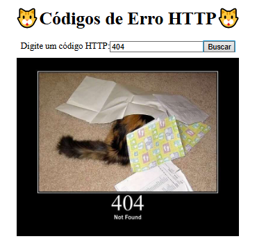

## 🐱 HTTP Cats

🌐 HTTP Cats é um projeto divertido que transforma os códigos de status HTTP — como o famoso 404 — em imagens de gatos, cada um representando uma resposta diferente dos servidores web.

## 🚀 Projeto

O HTTP Cats tem como objetivo ensinar e ilustrar os códigos HTTP de forma leve e criativa. Cada código é representado por uma imagem única de um gato, misturando humor com conhecimento técnico. Ideal para devs, estudantes e curiosos da tecnologia.

## 📺 Preview 

## 🛠️ Construído com
 
* HTML5
* CSS3
* JavaScript
* API HTTP Cats
